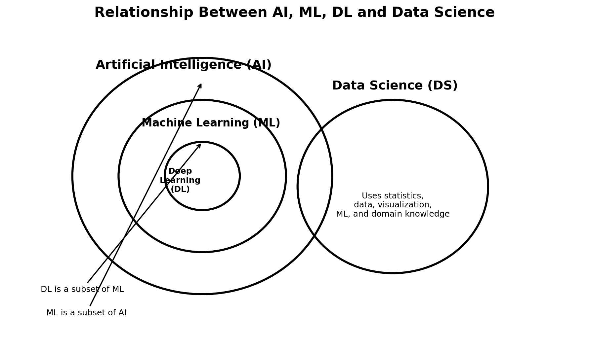

# Day 01 — Introduction to AI, ML and Deep Learning

Welcome to Day 1 of my Machine Learning journey.

In this first lecture, I learned the basic relationship between **Artificial Intelligence (AI), Machine Learning (ML), and Deep Learning (DL)**, along with an introduction to **Data Science (DS)**.

My goal is to document my learning step by step so that I can look back at my progress and other learners can follow the journey.

---

## 🎯 My Learning Goal

I am documenting my journey through:

- Machine Learning
- Artificial Intelligence
- Neural Networks
- Deep Learning
- Practical projects

I want to build strong fundamentals and gradually move from theory to implementation and projects.

---

## 1. What is Artificial Intelligence?

**Artificial Intelligence (AI)** is the broader field of creating computer systems that can perform tasks that normally require human intelligence.

Examples include:

- Understanding language
- Recognizing images
- Making decisions
- Solving problems
- Planning
- Recognizing patterns

### Simple idea

> **AI → The goal is to make computers perform tasks that normally require human intelligence.**

---

## 2. What is Machine Learning?

**Machine Learning (ML)** is a subfield of AI.

Instead of explicitly programming every rule, we provide data and allow an algorithm to learn patterns from that data.

### Traditional programming

```text
Rules + Data → Output
```

### Machine Learning

```text
Data + Expected Results
          ↓
      ML Algorithm
          ↓
     Learned Pattern
          ↓
       Prediction
```

### Example

Suppose we want a computer to predict house prices.

Instead of writing rules such as:

```text
If area is large → expensive
If location is good → expensive
```

we can provide many examples of houses with their features and prices.

The ML algorithm learns relationships from the data and uses them to make predictions for new houses.

---

## 3. What is Deep Learning?

**Deep Learning (DL)** is a specialized subfield of Machine Learning that uses **artificial neural networks with multiple layers**.

A simplified neural network looks like:

```text
Input Layer
     ↓
Hidden Layer
     ↓
Hidden Layer
     ↓
Output Layer
```

Deep learning becomes especially useful for complex data such as:

- Images
- Audio
- Text
- Video

### Example: Cat Image Classification

A neural network can receive an image and gradually learn useful features.

```text
Image
  ↓
Neural Network
  ↓
Hidden Layers
  ↓
Learned Features
  ↓
Output
  ↓
"Cat"
```

---

## 4. Relationship Between AI, ML and DL

The simplest way to remember the relationship is:

```text
Artificial Intelligence
        │
        └── Machine Learning
                │
                └── Deep Learning
```

So:

- **AI** is the broader field.
- **ML** is a subset of AI.
- **DL** is a subset of ML.

> Deep Learning ⊂ Machine Learning ⊂ Artificial Intelligence

---

## 5. What is Data Science?

**Data Science** is a broader interdisciplinary field focused on extracting useful information and insights from data.

It can involve:

- Statistics
- Mathematics
- Programming
- Data cleaning
- Data visualization
- Machine Learning
- Domain knowledge

Data Science and Machine Learning overlap, but they are **not the same thing**.

A Data Scientist may use Machine Learning, but Data Science also includes many tasks that happen before and after model training.

---

## 🧠 AI vs ML vs DL vs DS

| Field | Main Idea |
|---|---|
| AI | Building systems that perform tasks associated with intelligence |
| ML | Learning patterns from data |
| DL | Using multi-layer neural networks to learn complex patterns |
| DS | Extracting useful insights from data using multiple techniques |

---

## 📌 Key Takeaways

1. AI is the broad field of intelligent computer systems.
2. Machine Learning is a subset of AI.
3. Deep Learning is a subset of Machine Learning.
4. Deep Learning commonly uses multi-layer neural networks.
5. Data Science is related to ML but is not simply a subset of AI.
6. Machine Learning allows systems to learn patterns from data rather than relying only on explicitly written rules.

---

## ❓ Questions I Have

As I continue learning, I want to understand:

- How exactly does a machine learning algorithm learn?
- How are mathematical equations used in ML?
- How does a neural network learn its weights?
- How do we evaluate whether a model is good?
- When should we use traditional ML versus Deep Learning?

These are questions I expect to answer as my journey continues.

---

## 📚 My Notes

I also keep handwritten notes while learning.

The cleaned conceptual diagram from this lecture is available here:



---

## 🚀 Next

I will continue documenting each lecture in this repository and gradually add:

- Python implementations
- Machine Learning algorithms
- Mathematics and statistics
- Experiments
- Mini projects
- Larger projects

**Day 01 completed ✅**
