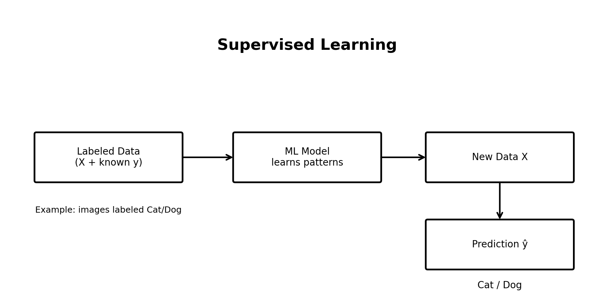
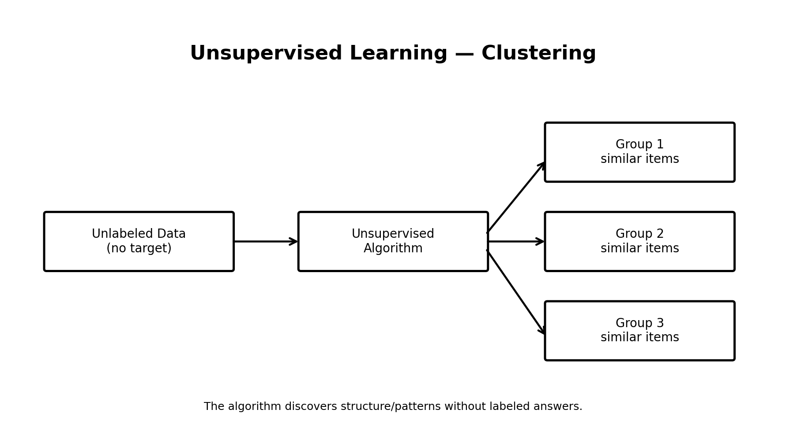
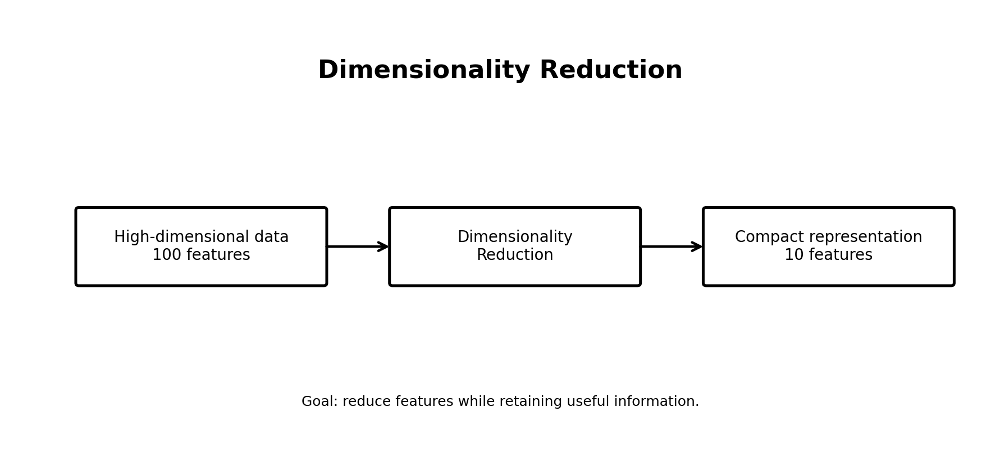
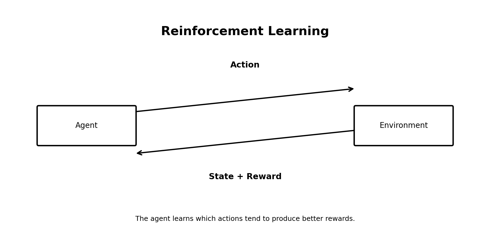

# Day 02 — Types of Machine Learning

In Day 2, I learned the **three major learning paradigms in Machine Learning**:

1. Supervised Learning
2. Unsupervised Learning
3. Reinforcement Learning

I also learned about **Regression, Classification, Clustering, and Dimensionality Reduction**.

---

## 1. Supervised Learning

### What is it?

In supervised learning, a model learns from **labeled data**.

The training data contains:

- Input features `X`
- A known target/label `y`

The model learns a relationship between the input and the known target so that it can make predictions for new data.

### Simple idea

```text
Labeled Data
(X + known answer)
       ↓
   ML Model
       ↓
Learned patterns
       ↓
New Data
       ↓
Prediction
```



### Example — Cat vs Dog

Suppose we have:

```text
1000 Cat Images → label = Cat
1000 Dog Images → label = Dog
```

The model uses these labeled examples to learn useful patterns.

Later, when we provide a new image:

```text
New Image
   ↓
Trained Model
   ↓
Cat / Dog
```

### Main types of Supervised Learning

#### A. Regression

Regression is used when the target is a **continuous numerical value**.

Examples:

- Predicting house price
- Predicting temperature
- Predicting salary
- Predicting sales

Example:

```text
Input: house features
Output: ₹75,00,000
```

The output is a number that can vary continuously.

#### B. Classification

Classification is used when the target belongs to a **class/category**.

Examples:

- Cat or Dog
- Spam or Not Spam
- Disease or No Disease
- Fraud or Not Fraud

The output is a category rather than a continuous number.

### Common Classification Algorithms

Some algorithms used for classification include:

- Logistic Regression
- K-Nearest Neighbors (KNN)
- Decision Trees
- Random Forest
- Support Vector Machines (SVM)
- Naive Bayes
- Neural Networks

> Note: Some of these algorithms can also be adapted for other tasks. For example, decision trees, random forests, SVMs, and neural networks have both classification and regression variants.

---

## 2. Unsupervised Learning

In unsupervised learning, the training data does **not** contain known target labels.

The algorithm tries to discover useful patterns or structure in the data by itself.

### Simple idea

```text
Unlabeled Data
      ↓
Unsupervised Algorithm
      ↓
Discovered Patterns / Structure
```



### Example — Customer Segmentation

Suppose we have information about 1000 customers:

- Age
- Income
- Spending behavior
- Purchase frequency

But we do not tell the model which customers belong to which group.

An algorithm may discover groups such as:

```text
Group 1 → High-value customers
Group 2 → Regular customers
Group 3 → Budget customers
```

These groups are discovered from the patterns in the data.

### A. Clustering

Clustering means **grouping similar data points together**.

For example:

```text
○ ○ ○ ○       △ △ △ △       □ □ □
○ ○ ○         △ △ △         □ □ □
```

The algorithm tries to identify groups of similar points.

A common clustering algorithm is **K-Means Clustering**.

### B. Dimensionality Reduction

Dimensionality reduction means reducing the number of features while trying to retain the useful information in the data.

For example:

```text
100 features
     ↓
Dimensionality Reduction
     ↓
10 useful dimensions
```



Why can this be useful?

- Makes data easier to visualize
- Can reduce redundancy
- Can reduce noise in some situations
- Can make models more efficient
- Can help with high-dimensional datasets

A well-known technique is **Principal Component Analysis (PCA)**.

> Important: dimensionality reduction is generally treated as an unsupervised learning task, although some dimensionality-reduction methods use labels or other supervision.

---

## 3. Reinforcement Learning

Reinforcement Learning (RL) is a learning paradigm in which an **agent interacts with an environment**.

The agent takes actions and receives feedback in the form of rewards or penalties.

Over time, it learns a strategy for choosing actions that can lead to better long-term rewards.



### Basic RL loop

```text
Agent
  ↓
Action
  ↓
Environment
  ↓
Reward + New State
  ↓
Agent
```

### Example

Imagine an agent learning to play a game.

```text
Agent takes action
        ↓
Game responds
        ↓
Reward / penalty
        ↓
Agent learns
        ↓
Chooses better actions
```

The agent is not simply given the correct answer for every situation. It learns through interaction and feedback.

---

# 4. Comparing the Three Learning Paradigms

| Type | Training information | Main goal | Example |
|---|---|---|---|
| Supervised | Labeled data | Predict target | Cat/Dog classification |
| Unsupervised | Unlabeled data | Discover structure | Customer clustering |
| Reinforcement | Rewards/feedback | Learn actions/strategy | Game-playing agent |

### Easy way to remember

```text
Supervised
→ "I have the answers."

Unsupervised
→ "Find the patterns yourself."

Reinforcement
→ "Try actions and learn from rewards."
```

---

# 5. What I Learned Today

### Supervised Learning

- Uses labeled data.
- Main tasks include regression and classification.
- The model learns from known target values.

### Unsupervised Learning

- Works without target labels.
- Finds patterns or structure in data.
- Includes tasks such as clustering and dimensionality reduction.

### Reinforcement Learning

- Uses an agent and an environment.
- The agent takes actions.
- Rewards and penalties provide feedback.
- The agent learns a strategy over time.

---

# 6. Important Terms

| Term | Meaning |
|---|---|
| Feature | An input variable used by a model |
| Label / Target | The value the model is trying to predict |
| Labeled Data | Data containing inputs and known targets |
| Unlabeled Data | Data without known target labels |
| Regression | Predicting a continuous numerical value |
| Classification | Predicting a category/class |
| Clustering | Grouping similar data points |
| Agent | The learner in reinforcement learning |
| Environment | The world/system the agent interacts with |
| Reward | Feedback that encourages useful behavior |

---

# 7. Questions I Want to Answer Next

As I continue learning, I want to understand:

- How does a supervised learning model actually learn from labeled data?
- What is the difference between regression and classification mathematically?
- How does K-Means decide which points belong to a cluster?
- How does PCA reduce dimensions?
- How does an RL agent decide which action to take?
- What exactly happens during model training?

---

# 📚 Day 2 Summary

```text
Machine Learning
│
├── Supervised Learning
│   ├── Regression
│   └── Classification
│
├── Unsupervised Learning
│   ├── Clustering
│   └── Dimensionality Reduction
│
└── Reinforcement Learning
    └── Learning through rewards and feedback
```

**Day 02 completed ✅**

---

## Next

In the next lessons, I will start going deeper into individual Machine Learning concepts and algorithms, and I will implement what I learn using Python.
