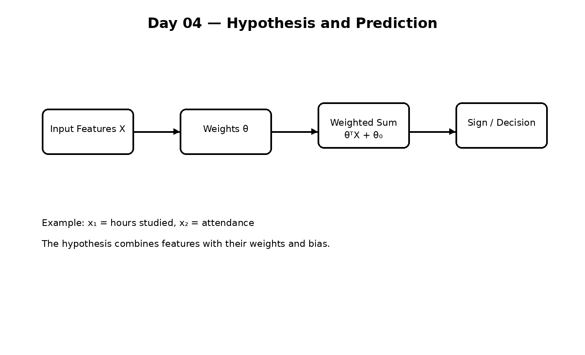
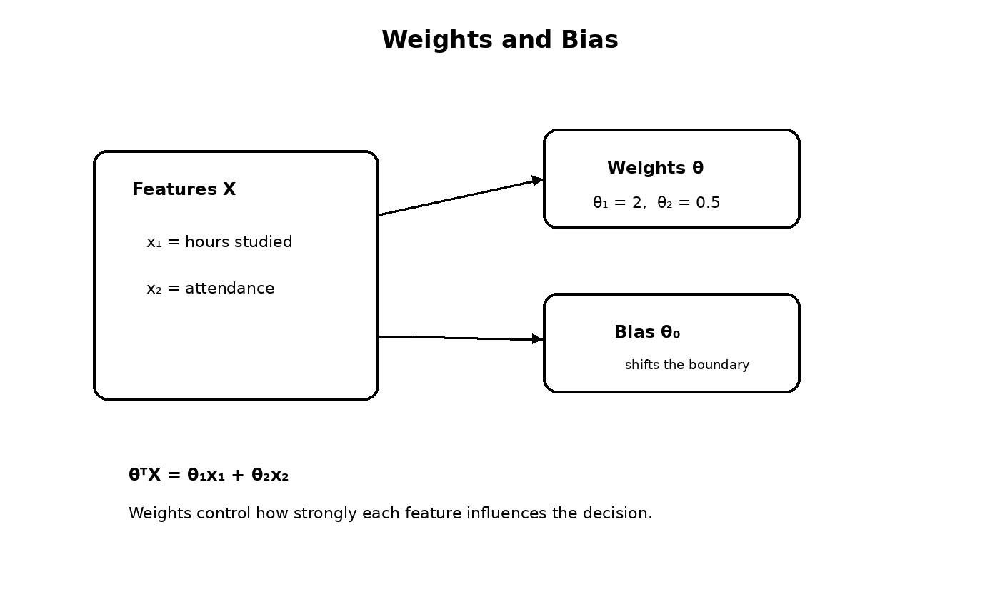
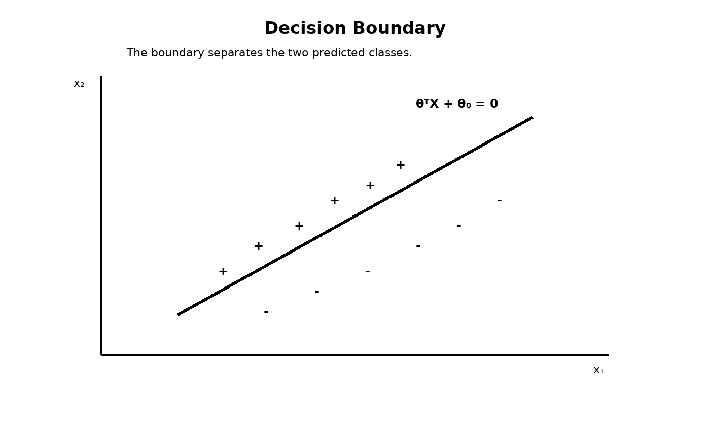
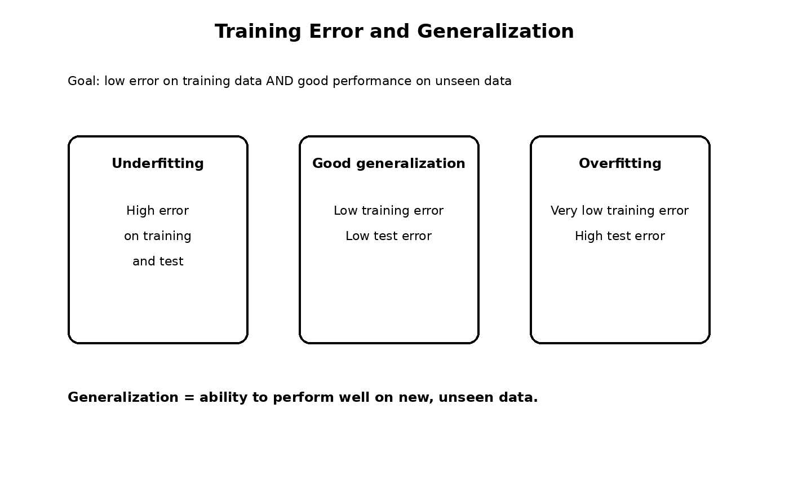

# Day 04 — Hypothesis, Parameters & Decision Boundary

Today I learned how a supervised learning model makes a prediction from input features.

## Topics covered

1. **Hypothesis** — the rule/function used by a model to produce a prediction.
2. **Features (X)** — the input information given to the model.
3. **Weights / Parameters (θ)** — values that determine how strongly each feature influences the prediction.
4. **Bias / Intercept (θ₀)** — shifts the model's prediction or decision boundary.
5. **Weighted sum** — `θᵀX + θ₀` combines the features with their weights.
6. **Sign function** — can convert the score into a class decision such as `+1` or `-1`.
7. **Decision boundary** — the boundary where the model changes from one class to another.
8. **Training error** — measures how incorrectly the model predicts the training examples.
9. **Generalization** — the ability to perform well on unseen data.
10. **Underfitting vs. good generalization vs. overfitting**.

## Simple example

Suppose:

- `x₁ = hours studied`
- `x₂ = attendance`
- `θ₁ = 2`
- `θ₂ = 0.5`

The weighted part is:

`θᵀX = θ₁x₁ + θ₂x₂`

The bias `θ₀` is then added:

`z = θᵀX + θ₀`

A classification rule can apply a sign function to `z` to decide the class.

## Key idea

The learning algorithm searches for useful parameter values so that the hypothesis makes accurate predictions and generalizes to new data.

## Diagrams

### Hypothesis pipeline

### Weights and bias

### Decision boundary

### Training error and generalization

---
*These notes are a cleaned-up version of my handwritten Day 04 learning notes.*
